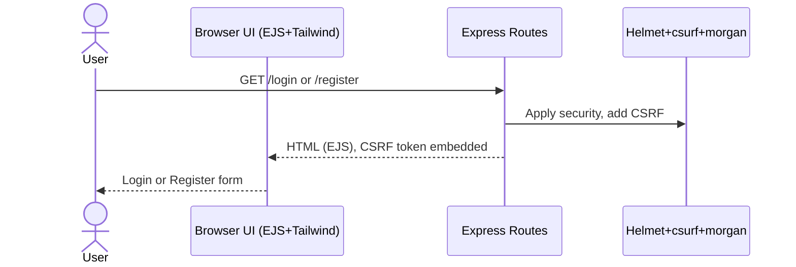
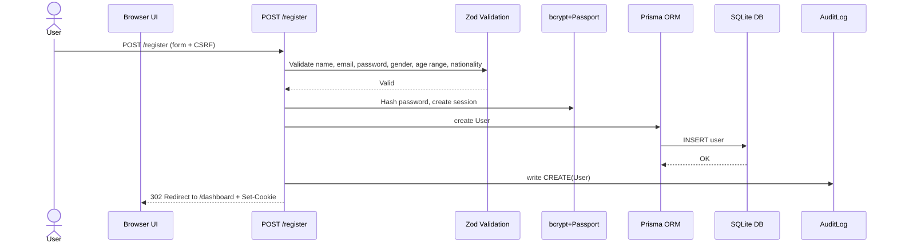
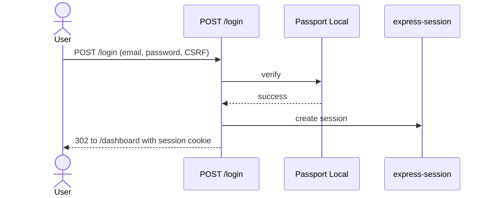
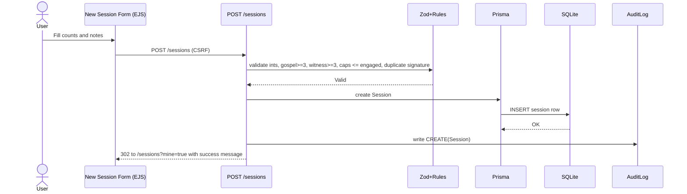
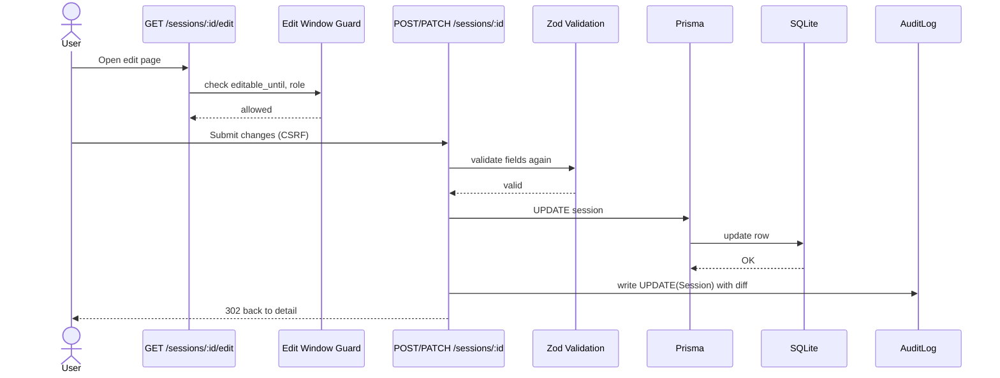
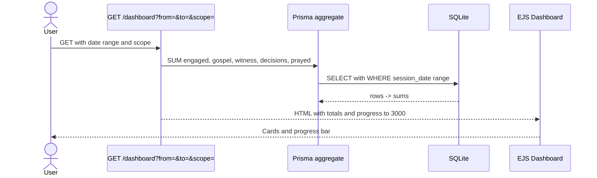
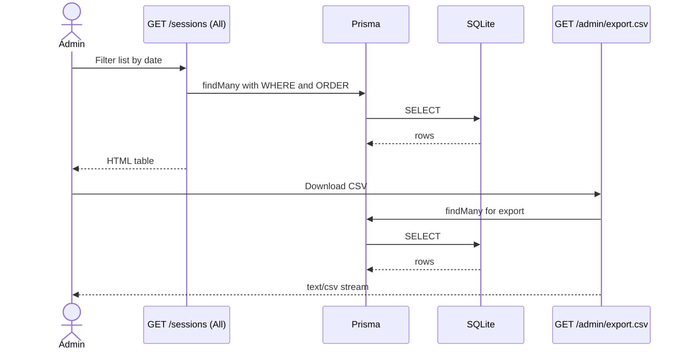
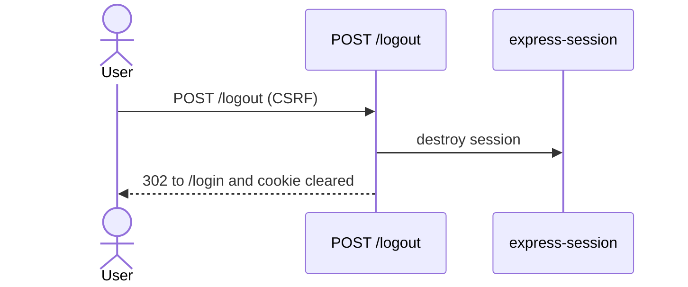
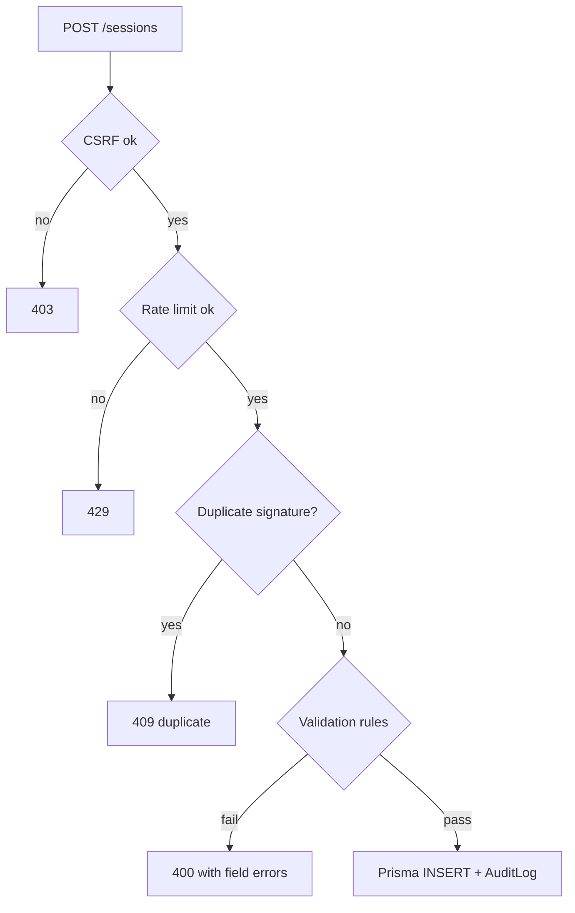

## E-3000 User Flows and Technology Interactions

This document shows each user behavior in the app and which technologies handle it. Diagrams are Mermaid blocks you can paste into any Mermaid viewer.

Tech components at a glance

- UI: EJS templates, Tailwind CSS, a light touch of HTMX, vanilla JS where needed

- Server: Node.js, Express routes, Passport Local auth with express-session, bcrypt, Zod validation, Helmet, csurf, express-rate-limit, morgan

- Data: Prisma ORM, SQLite database, AuditLog table

- Deploy: Render or Railway, custom domain, daily DB backups

## 1) First visit: view Login or Register

What happens

- Express serves EJS page styled by Tailwind

- Helmet adds security headers

- csurf injects CSRF token in the form

- morgan logs the request

## 2) Register

What happens

- Zod validates fields

- bcrypt hashes password

- Prisma writes user to SQLite

- Passport starts a session, cookie set

- AuditLog records CREATE
  

## 3) Login

What happens

- Passport verifies credentials

- express-session creates session

- csurf and rate limit protect the endpoint
  

## 4) Create a new session submission

What happens

- EJS form includes CSRF token

- Zod validates types and rules

- Duplicate signature guard prevents accidental repeats

- Prisma inserts session

- AuditLog records CREATE

## 5) Edit or delete within 24 hours

What happens

- Guard checks edit window and role

- Zod revalidates fields on save

- Prisma updates or deletes

- AuditLog records UPDATE or DELETE

## 6) View dashboard and totals

What happens

- Prisma runs aggregate queries for sums

- Date range and scope filters apply

- EJS renders cards and progress to 3000

## 7) Admin views all sessions and exports CSV

What happens

- Admin lists sessions with filters

- CSV export streams rows with headers

- Rate limit guards export endpoint

## 8) Logout

What happens

- Passport destroys session

- Cookie cleared

- Redirect to login

## 9) Safeguards that trigger during flows

What happens

- express-rate-limit on POST routes

- CSRF check on every mutating request

- Duplicate signature detection

- Validation rules for numbers and ratios

- Optional suspicious flags and under review filter

## Scope notes

- Admins can submit sessions the same way evangelists do

- Aggregates are computed on demand for simplicity and freshness

- Daily backups and environment variables are part of ops hygiene