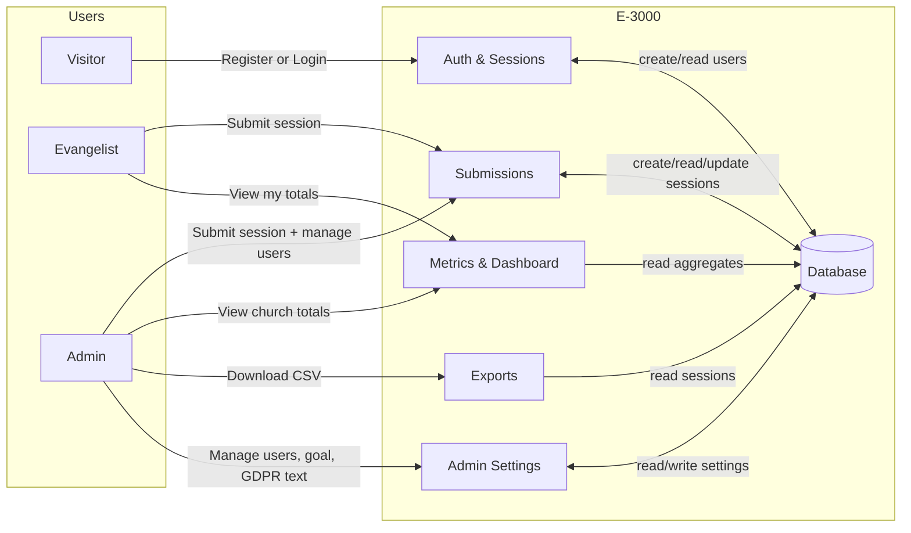
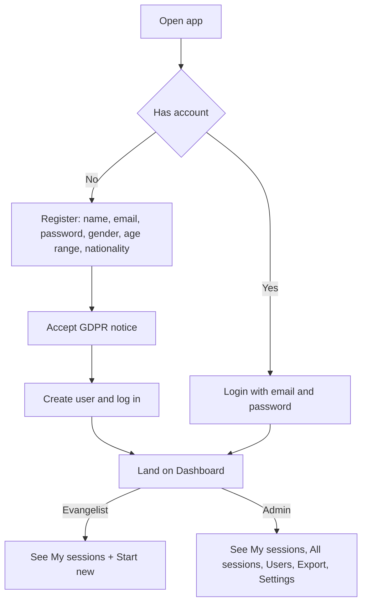
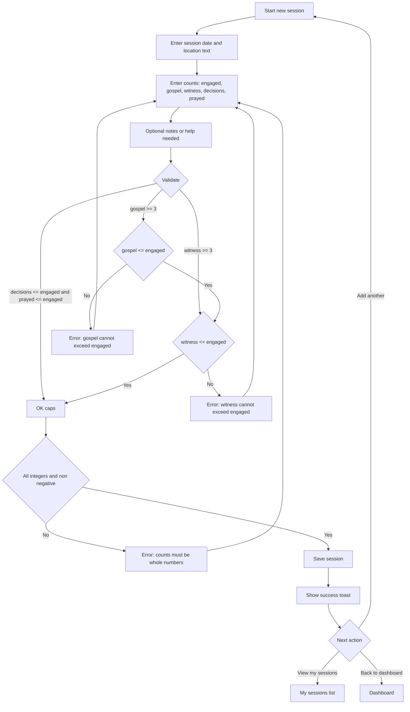
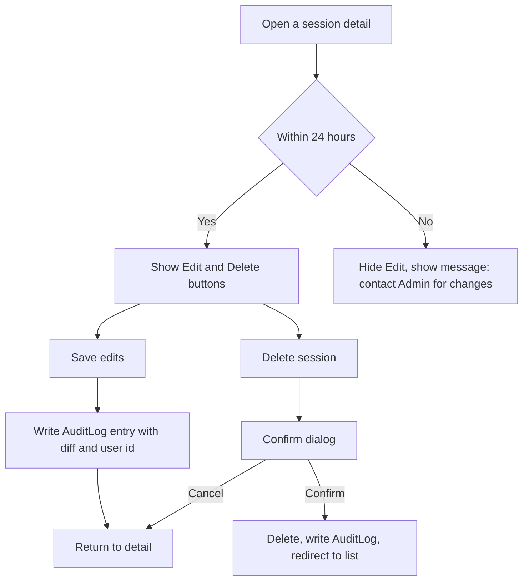
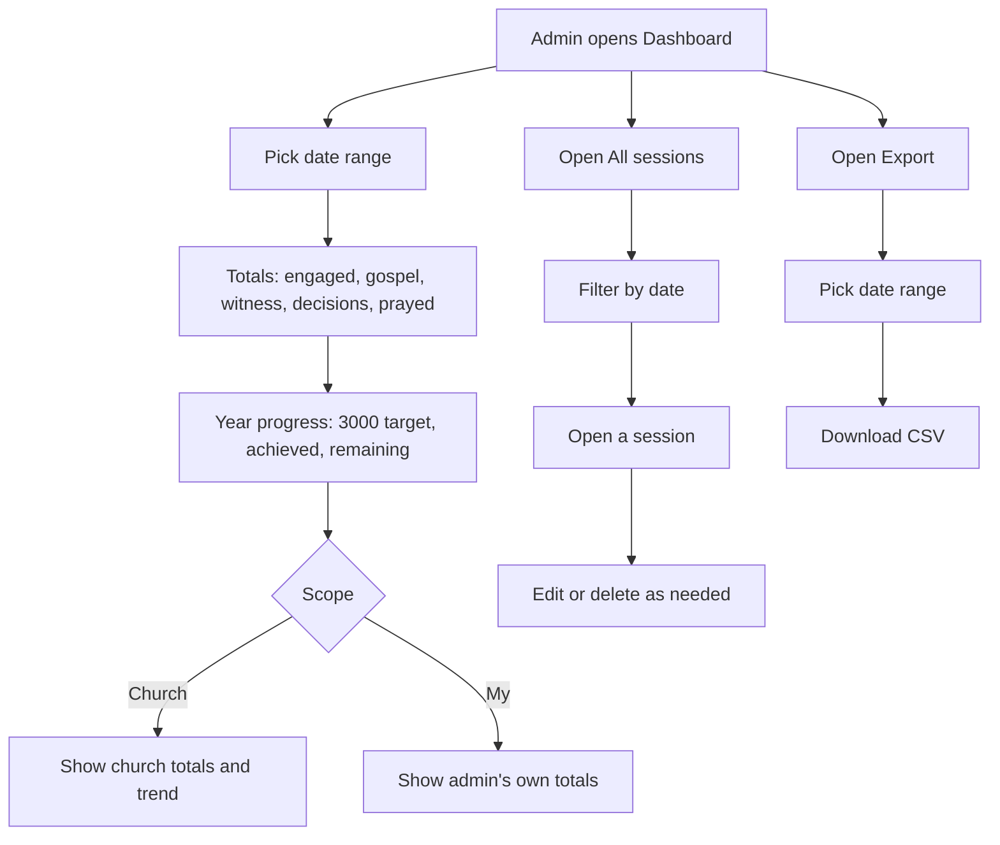
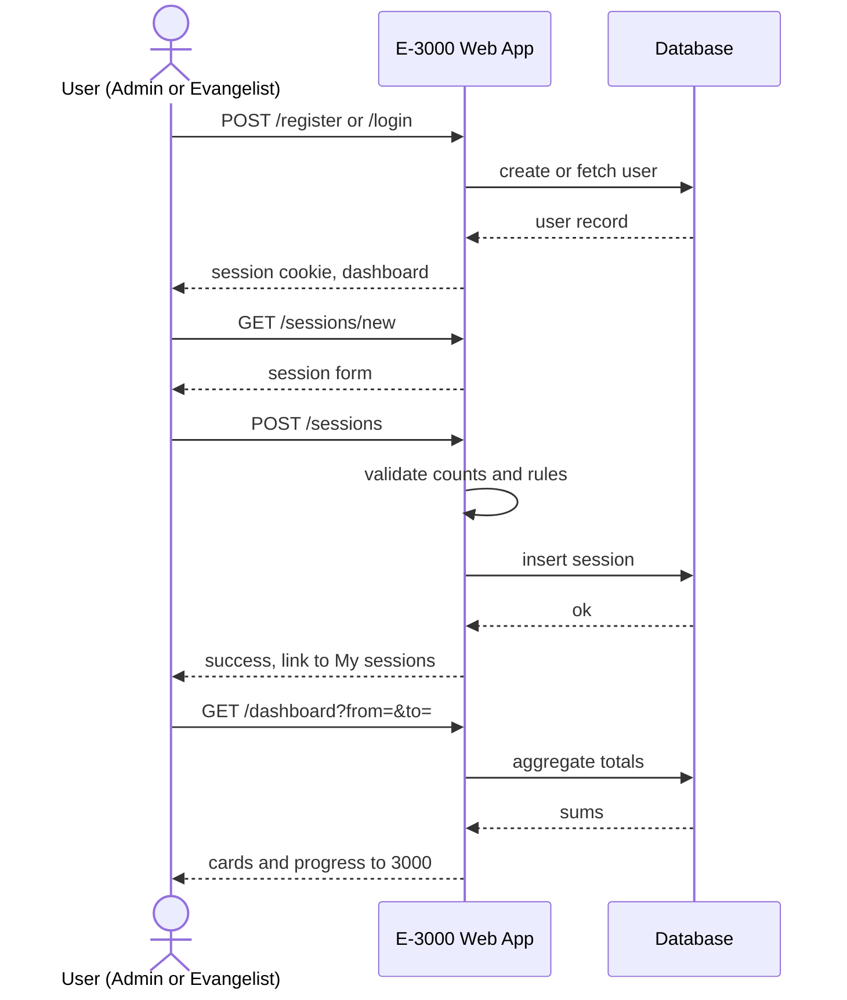

```mermaid 
flowchart LR
  subgraph Users
    A[Visitor]
    B[Evangelist]
    C[Admin]
  end

  subgraph E-3000
    S1[Auth & Sessions]
    S2[Submissions]
    S3[Metrics & Dashboard]
    S4[Exports]
    S5[Admin Settings]
    DB[(Database)]
  end

  A -->|Register or Login| S1
  B -->|Submit session| S2
  C -->|Submit session + manage users| S2
  C -->|View church totals| S3
  B -->|View my totals| S3
  C -->|Download CSV| S4
  C -->|Manage users, goal, GDPR text| S5

  S1 <-->|create/read users| DB
  S2 <-->|create/read/update sessions| DB
  S3 -->|read aggregates| DB
  S4 -->|read sessions| DB
  S5 <-->|read/write settings| DB
```

```mermaid
flowchart TD
  L0[Open app] --> L1{Has account}
  L1 -->|No| L2[Register: name, email, password, gender, age range, nationality]
  L2 --> L3[Accept GDPR notice]
  L3 --> L4[Create user and log in]

  L1 -->|Yes| L5[Login with email and password]

  L4 --> L6[Land on Dashboard]
  L5 --> L6[Land on Dashboard]

  L6 -->|Evangelist| L7[See My sessions + Start new]
  L6 -->|Admin| L8[See My sessions, All sessions, Users, Export, Settings]


```

```mermaid
flowchart TD
  S0[Start new session] --> S1[Enter session date and location text]
  S1 --> S2[Enter counts: engaged, gospel, witness, decisions, prayed]
  S2 --> S3[Optional notes or help needed]

  S3 --> V0{Validate}
  V0 -->|gospel >= 3| V1{gospel <= engaged}
  V0 -->|witness >= 3| V2{witness <= engaged}
  V0 -->|decisions <= engaged and prayed <= engaged| V3[OK caps]
  V1 -->|No| E1[Error: gospel cannot exceed engaged]
  V2 -->|No| E2[Error: witness cannot exceed engaged]
  V3 --> V4{All integers and non negative}
  V4 -->|No| E3[Error: counts must be whole numbers]
  V1 -->|Yes| V2
  V2 -->|Yes| V3
  V4 -->|Yes| S4[Save session]

  E1 --> S2
  E2 --> S2
  E3 --> S2

  S4 --> S5[Show success toast]
  S5 --> S6{Next action}
  S6 -->|Add another| S0
  S6 -->|View my sessions| S7[My sessions list]
  S6 -->|Back to dashboard| D[Dashboard]

```

```mermaid
flowchart TD
  E0[Open a session detail] --> E1{Within 24 hours}
  E1 -->|Yes| E2[Show Edit and Delete buttons]
  E1 -->|No| E3[Hide Edit, show message: contact Admin for changes]

  E2 --> E4[Save edits]
  E4 --> E5[Write AuditLog entry with diff and user id] --> E6[Return to detail]

  E2 --> E7[Delete session]
  E7 --> E8[Confirm dialog]
  E8 -->|Confirm| E9[Delete, write AuditLog, redirect to list]
  E8 -->|Cancel| E6

```

```mermaid
flowchart TD
  A0[Admin opens Dashboard] --> A1[Pick date range]
  A1 --> A2[Totals: engaged, gospel, witness, decisions, prayed]
  A2 --> A3[Year progress: 3000 target, achieved, remaining]
  A3 --> A4{Scope}
  A4 -->|Church| A5[Show church totals and trend]
  A4 -->|My| A6[Show admin's own totals]

  A0 --> A7[Open All sessions]
  A7 --> A8[Filter by date]
  A8 --> A9[Open a session]
  A9 --> A10[Edit or delete as needed]

  A0 --> AX[Open Export]
  AX --> AY[Pick date range]
  AY --> AZ[Download CSV]

```

```mermaid
sequenceDiagram
  actor U as User (Admin or Evangelist)
  participant App as E-3000 Web App
  participant DB as Database

  U->>App: POST /register or /login
  App->>DB: create or fetch user
  DB-->>App: user record
  App-->>U: session cookie, dashboard

  U->>App: GET /sessions/new
  App-->>U: session form

  U->>App: POST /sessions
  App->>App: validate counts and rules
  App->>DB: insert session
  DB-->>App: ok
  App-->>U: success, link to My sessions

  U->>App: GET /dashboard?from=&to=
  App->>DB: aggregate totals
  DB-->>App: sums
  App-->>U: cards and progress to 3000

```